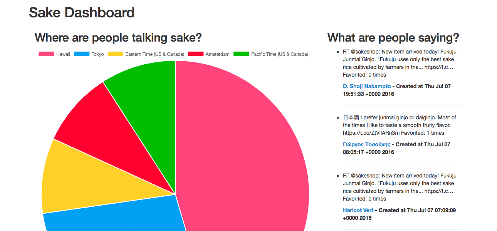

== Japanese Sake Dashboard

## About
The Japanese Sake Dashboard automatically fetches Japanese sake-related tweets and data from Twitter. It then displays the information in via a timeline and chart.

## Technologies
* Rails
* ChartJS
* Oauth
* Twitter API
* rSpec
* Bootstrap
* Ruby 2.2.1

## How to run Japanese Sake Dashboard

## How to run the test suite
At directory "twitter-project/twitterapp", run "rspec"

## Screenshots
